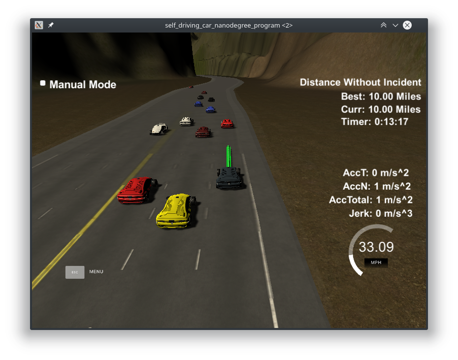
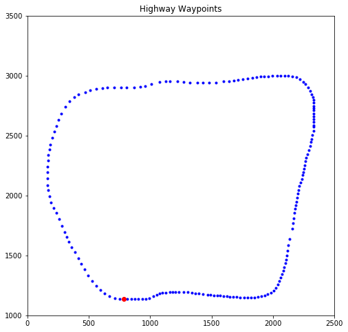
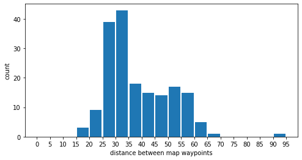

# **Highway Path Planning**



# Overview

This project implements highway path planning for Udacity Self-Driving Car Nanodegree project. The highway is a ~7 [km] loop with three lanes and other cars moving with their own logics. The plan must cause the car to traverse the loop as quickly as possible without violating speed, acceleration, and jerk limits (50 [mph], 10 [m/s^2], and 10 [m/s^3] respectively. The car must perform this without hitting other cars, without straddling lanes for longer than necessary, and without straying off road or to the opposite direction traffic.


Highway map, blue dots are map waypoints, red dot is the first waypoint


Distribution of distance in *sd*-frame of map waypoints.

# Building and Running

This program uses CMake. To build it in a `build` folder, do

```bash
$ mkdir build && cd build
$ cmake ..
$ make
```

Afterwards, run it with

```bash
$ ./path_planning
```

It will wait for the simulator to be ready. Get the term3 simulator from [here](https://github.com/udacity/self-driving-car-sim/releases/tag/T3_v1.2).

# Lane following

When following a lane, we generate waypoints with splines. The splines are built around anchor points picked from current car location or waypoints from a preceding cycle, and spaced out points further along the highway. The built splines are then sampled for points along it, spaced at a distance equals to the car's current speed multiplied by the fixed time sample (20 [ms]).

To avoid collisions with other cars ahead of ours, the waypoints are generated such that our car is always at least a set distance behind the closest leading car, and its target speed matches the measured speed of the lead car, if lower than the maximum allowable speed.

Planning is done up to a time horizon. Here it is chosen to be 800 [ms].

We will discuss the implementation details in the next subsections.

## Generating paths

At the beginning of a planning cycle, we estimate the speed and heading of our car at the end of the previous planning cycle using the last two points `(x', y')` and `(x'', y'')` from said previous planning cycle. We also save the *xy*-coordinate at the last waypoint as reference for coordinate transformation later.

```
vx = (x' - x'')/dt
vy = (y' - y'')/dt
v_ref = sqrt(vx^2 + vy^2)
yaw_ref = arctan((y' - y'')/(x' - x''))
x_ref = x'
y_ref = y'
```

In the initial planning cycle, or when there is not enough points from the previous planning cycle, we take the reported current car speed and heading from the simulator, and estimate the previous location instead.

```
x' = car_x
y' = car_y
x_ref = x'
y_ref = y'

v_ref = car_speed
yaw_ref = car_yaw

x'' = x' - cos(car_yaw)
y'' = y' - sin(car_yaw)
```

The last two points, `(x', y')` and `(x'', y'')`, however they are generated are used as the first two points in the anchor.

```
anchor_x = [x'', x']
anchor_y = [y'', y']
```

Then, three more anchor points are added, the first one an `anchor_step` away from the final point in the previous plan one in the *sd*-coordinate (said differently, an `anchor_step` distance further along the highway). The second is an `anchor_step` further from the first, and similarly with the third. The variable `anchor_step` is set to be 30 [m] in normal conditions (close to the average distance between two consecutive waypoints in the map). It is adjusted when changing lanes, as we will discuss in its section later. They are then transformed to *xy*-coordinate using the `getXY` funtion provided in the starter code. The final set of anchor points looks like:

```
anchor_x = [x'', x', x30, x60, x90]
anchor_y = [y'', y', y30, y60, y90]
```

The final point in *sd*-frame is calculated from `(x', y')` using the `getFrenet` function provided in the helper header of the starter code. 

The five anchors are then transformed into the car-local frame of reference (with `x_ref`, `y_ref`, and `yaw_ref` calculated earlier), so that the second anchor point `(x', y')` is transformed to `(0.0, 0.0)`.

The anchor points in car-local frame are then made into spline, where we can query it with an `x` value and get a corresponding `y` value (all in car-local frame). Our next task is then to decide the spacing of our `x` queries such that the resulting points can be visited by the car every 20 [ms] without violating the speed, acceleration, and jerk limits.

First, we project the `x` value in car-local frame a set distance ahead (30 [m]), let's call this `x30`. Then, we ask the spline what `y30 = spline(x=30)` is. Next, we calculate the distance from the origin of the car-local frame to `(x30, y30)`, let's label this `d30`.

Suppose our car moves at speed `v_target` in a straight line from car-local origin to `(x30, y30)`. The number of 20 [ms] segments along this distance is then `N = d30/(v_target*20e-3)`. We then divide the `x`-axis into the same number of segments, so each would be of length `dx = (x30-0)/N`. If our car is moving at constant speed, we sample the spline at this interval, such that

```
x_points = [0, dx, 2*dx, 3*dx, ...]
y_points = [0, spline(dx), spline(2*dx), ...]
```

We transfer these points to the global *xy*-frame, prepend points from the previous path, then send it over to the simulator. However, we would like our car to be able to accelerate, so let's extend this method to allow that.

The initial step is the same, we calculate `x30`, `y30`, `d30`, `N`, and `dx` with the same process, except instead of `v_target`, we use the estimated car speed at the end of the previous path, calculated earlier as `v_ref`.

Let us call the current end of the generated path as `(xf, yf)`. At this stage, they are `(0+dx, spline(dx))`.

Also, let us call the maximum acceleration allowed `a_max`. We can go further and define `jerk_max` instead, but experiments show that setting `a_max` does not result in jerk limit violation in the simulator, so we keep it simple.

The remaining distance to `(x30, y30)` is then 

```
d30' = distance((xf, yf), (x30, y30))
```

If our current speed is lower than maximum allowed, we use the intervening 20 [ms] to accelerate as much as possible, so 

```
v_ref' = v_ref + a_max*20e-3
```

Similarly, if our current speed is higher than maximum allowed, we deccelerate as much as possible, 

```
v_ref' = v_ref - a_max*20e-3
```

We use this new speed to calculate a new `N` from the remaining distance

```
N' = d30' / (v_ref' * 20e-3)
```

Then we divide the remaining *x*-axis into `N'` segments

```
dx' = (x30 - xf)/N'
xf' = xf + dx'
```

And find the corresponding *y*

```
yf' = spline(xf')
```

We continue the process until we have generated enough points. Then we transfer them to the global *xy*-frame, prepend points from previous path to the list, and send them along to the simulator.

## Avoiding collisions

To avoid collision with a leading car in the same lane, we adjust the target speed of our car `v_target`. When there is no leading car, this value is set to maximum speed (49 mph, 1 mph lower than the absolute max of 50 for some wiggle room).

For cars detected through sensor fusion (in this case, the `sensor_fusion` variable given by the simulator), we have its position and speed in both *xy* and *sd* coordinates. To calculate the lane number of a detected car (say, other-car), we use its *d*-coordinate:

```
other_lane = floor(other_d / 4)
```

If the other-car is in the same lane as our car, then it is of interest to us. First, check that it is ahead from us `other_s > car_s`. Then, project its position at the horizon of our planning window

```
other_s_expect = other_s + other_v * t_horizon
```

Define a minimum distance `dist_min` we want to keep our car from a leading other-car. Now, we can calculate the maximum speed our car can move in while maintaining that distance

```
v_lane = (other_s_expect - dist_min - car_s)/t_horizon
```

If `v_lane` is higher than maximum allowed speed, then the lead other-car is far enough ahead that we can continue to move at maximum speed. If it is lower than zero, then our car is already closer than the minimum distance, in which case, we match the other car's speed instead.

We do this calculation for each detected car in the same lane our car is in, and take `v_lane` to be the lowest of all, then we set our car's target speed `v_target = v_lane`. The waypoint calculation described in previous subsection will take care of achieving this speed without break acceleration limits.

# Changing lanes

When our car cannot move at maximum speed in its current lane because of a slow lead other-car, we should consider moving to other lanes. In this implementation, we would plan lane change only for one lane at a time. So lane change from centre to left or right is considered, but from leftmost to rightmost is not. However, it may be the case that after a left-centre shift, the right lane is judged to be advantageous and a centre-right shift is immediately planned and executed.

We will discuss picking the most advantageous lane and executing a lane change in the next two subsections.

## Picking the best lane

The value of a lane is its maximum speed. The larger the achievable maximum speed in a lane, the *better* it is.

For the purpose of lane picking, every lane is assigned maximum speed of 5 times `v_max`. The car planner would still respect `v_max`.

For each detected other-car, their position and speed informs the maximum speed of their respective lane. For other-cars ahead of our car in the *sd*-frame, the maximum speed of their lane is how fast our car can move in order to arrive at `dist_min` behind them at the end of the planning horizon:

```
v_max_lane = (other_s_expect - dist_min - car_s)/t_horz
```

When there are multiple other-cars detected ahead in a lane, the final `v_max_lane` is the lowest. 

On the other hand, for each detected other-car in behind our car in *different* lanes, we have to calculate the *minimum* speed we have to move in in order to not hit them when changing lane:

```
v_min_lane = (other_s_expect + 2*dist_min - car_s)/t_horz
```

When this value is larger than the current `v_target`, then we risk hitting the car in front of us when changing lane. Naturally, `v_target <= v_max`. In this case, we want to forbid the car from picking this lane, even if it is empty ahead, until we have moved far enough ahead of the other-car. We do this by setting `v_max_lane = 0`.

Finally, we add a safety short-circuit for other-cars in different lanes that are close enough to our car in *sd*-coordinate: if their absolute s-distance is lower than half `dist_min`, then we forbid lane change by setting their respective `v_max_lane = 0`.

The calculation for maximum lane speed is done for every lane for every cycle, but we would only change our car's (target) lane to the best lane if it is not currently moving at `v_max` and the new target lane has a sufficiently high maximum speed, `v_lane > 1.5 v_target`.

## Executing lane change

To execute lane change, we change the `lane` variable to the new lane, and multiply the `anchor_step` by 1.5. Both would generate spline anchors transitioning from current lane to the next (better) lane and the usual path generation method will take care of the rest. The `anchor_step` multiplier makes the anchors further ahead and thus the curve easier, this reduces the risk of the car violating the maximum acceleration criterion when changing lanes (actual value was found from trial and error).

# Miscellaneous

## Status printout

For every planning cycle, the program produces a line of status printout in this format:

```
ln <lane>, progress <car_s/max_s> --- limits: <ln0 v_max> <ln1 v_max> <ln3 v_max>
```

For example, this line

```
ln: 2, progress:  2.302/6.946 --- limits:     0.00     0.00    35.58
```

would mean that the car is in lane 2, at 2.302 [km] from start, and the lane speed limits are 0.0, 0.0, and 35.58 [m/s]. This implies that the car is following a lead car in lane 2 and the other two lanes are congested with other-cars.

Laps are not taken into account. The example line is taken from the moment of the screenshot at the top of this document, so actual progress from start of program is really about 16 [km].

## Avenues for improvement

These might lead to improvement to the current behaviour and worth trying out:

- implement finite-state machine for car behaviour; e.g. lane following state, lane changing state, etc
- use minimum jerk trajectory instead of splines; more involved, but position, velocities, and acceleration can be set explicitly for each anchor

# Externs

These projects are used in the building of this work:

- Path planning project [starter code](https://github.com/udacity/CarND-Path-Planning-Project)
- [Simulator](https://github.com/udacity/self-driving-car-sim/releases/tag/T3_v1.2)
- [Spline](https://kluge.in-chemnitz.de/opensource/spline/)
